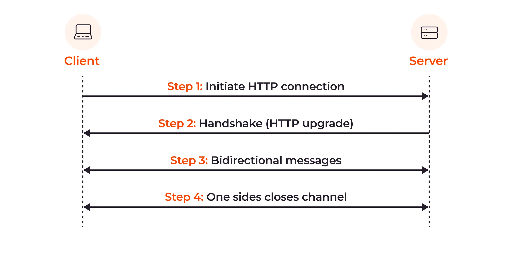
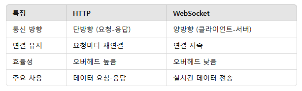

# WebSocket + STOMP
국제표준: https://datatracker.ietf.org/doc/html/rfc6455
## WebSocket 배경
### HTTP의 한계
* 기존 HTTP는 단반향 요청-응답 모델로 설계되었음
* 실시간 양방향 통신이 필요하면 매번 새 요청을 보내거나 폴링방식으로 진행하였음
* 항상 네트워크 지연과, 반복되는 핸드셰이크 과정을 통해 리소스를 많이 소비함
### 실시간 어플리케이션의 증가
온라인 게임, 채팅, 주식 거래 등 실시간 데이터 전송이 필요한 서비스가 증가하였으며 이러한 서비스엔 HTTP 단방향 구조는 적합하지 않았다.
서버-클라이언트간 지속적인 연결과 빠른 데이터 전송이 필수적이기 때문에, 단순 요청-응답으로는 사용자 경험을 충족시키기 어려웠음
## WebSocket
* 클라이언트와 서버 간에 양방향 통신을 가능하게 하는 프로토콜, 실시간 데이터 전송을 위해 HTTP의 핸드셰이크를 통해 연결을 설정함
* 클라이언트와 서버는 지속적인 연결을 유지하며 데이터를 주고 받는다.
### 특징
1. 양방향 통신: 데이터를 실시간으로 주고 받으며, 서버가 클라이언트로 직접 메시지를 전송할 수 있다.
2. 저렴한 비용: HTTP 요청과 비교하여 전송되는 데이터 크기가 작고, 한번 연결 이후 지속되므로 핸드셰이크 이후 오버헤드가 적다
3. 지속적 연결 유지: 연결이 끊어지지 않고 유지되며, 필요한 경우 클라이언트나 서버가 연결을 끊을 수 있다.
### 작동방식

1. 핸드셰이크: 클라이언트가 HTTP를 통해 WebSocket 프로토콜을 요청하고 서버는 확인/승인 한다.
2. 연결 설정: 핸드셰이크가 성공하면 TCP연결이 설정되고 WebSocket 연결이 유지된다.
3. 메시지 교환: 이후 클라이언트와 서버간 메시지를 전송한다.(핸드셰이크 단계는 반복되지 않는다)
4. 연결 해제: 필요 시 클라이언트나 서버에서 연결을 닫는다.
### 장단점
* 장점: 낮은 대기시간, 적은 비용, 연결 유지를 통한 실시간 전송
* 단점: 연결 관리가 필요, 브라우저 혹은 서버에서 WebSocket을 지원해야함
### WebSocket과 HTTP 비교

## SockJS
WebSocket 기능을 모든 환경에서 사용하고자 폴백(fallback)방식으로 구현한 라이브러리
WebSocket이 지원되지 않거나, 특정 환경에서 연결을 막아 못사용하는 경우 다양한 폴백 메커니즘을 제공하여 유사한 비동기 통신을 가능하게 함
### 특징
1. WebSocket 호환성: WebSocket이 지원되는 경우, SockJS는 우선적으로 WS을 사용
2. 폴백 옵션: XHR-Streaming, XHR-Polling, Iframe 등을 사용하여 양방향 통신을 유지
3. 브라우저 호환성: 폴백 옵션 덕분에 오래된 브라우저에서도 사용 가능
4. 안정적인 연결 유지: 연결이 끊어지면 자동으로 재연결을 시도
### 장단점
* 장점: 모든 환경에서 안정적인 실시간 통신을 가능하게 하고, WebSocket과의 높은 호환성을 제공
* 단점: 폴백 방식으로 약간의 오버헤드 발생, 효율성은 당연히 순수한 WS보단 떨어진다.
## STOMP(Simple Text Oriented Messaging Protocol)
텍스트 기반 메시징 프로토콜, 클라이언트 서버간 메시지 교환을 표준화함
### 특징
1. 텍스트 기반 프로토콜: 텍스트 형식으로 메시지를 주고받기 때문에 이해하고 디버깅하기 쉬우며, HTTP와 유사하게 커맨드와 헤더로 구성된다.
2. 메시지 기반 통신: PUB/SUB 모델을 지원하여 클라이언트가 특정 채널/토픽을 구독하고 서버는 채널에 메시지를 발행한다.
3. 브로커 연동: RabbitMQ, Kafka, ActiveMQ 등과 같은 메시지 브로커와 호환된다
4. WebSocket 결합: WebSocket 위에 STOMP를 사용하여 메시지 구독, 전송, 수신을 관리할 수있다.
### 기본 명령어
1. CONNECT: 클라이언트가 연결을 요청
2. SEND: 특정 목적지로 메시지를 전송
3. SUBSCRIBE: 특정 채널 / 토픽을 구독
4. UNSUBSCRIBE: 구독 취소
5. DISCONNECT: 연결을 종료
### 장단점
* 장점: 가볍고 단순한 프로토콜로 실시간 메시지 전송을 효율적으로 처리, 다양한 메시지 브로커와 호환되며 WebSocket과 결합하여 구현하기 쉽다
* 단점: 텍스트 기반 프로토콜이므로 바이너리 데이터를 다루는데 비효율적이며, 메시지가 커질 수 있다
### 메시지 구조
```
COMMAND
header1:value
header2:value

body
^@
```
* COMMNAD: 메시지의 종류를 나타내는 명령어
* 헤더: 키-벨류로 구성되어 있음
* 본문: 전달할 실제 데이터, 본문이 끝날 때 null문자(\0, STOMP에서는 ^@로 표시)로 끝을 표시함
### 예제
1. 연결 요청(CONNECT)
   ```
   CONNECT
   host:xxxx.com
   
   ^@
   ```
2. 구독 요청(SUBSCRIBE)
   ```
   SUBSCRIBE
   id:sub-0
   destination:/topic/chat
   ^@
   ```
   * id: 구독을 식별하기 위한 ID
   * destination: 구독하려는 목적지 (토픽 or 큐)
3. 메시지 전송(SEND)
   ```
   SEND
   destination:/topic/chat
   connect-type:text/plain
   
   Hello, STOMP!
   ^@
   ```
4. 서버로부터 받은 메시지(MESSAGE)
   ```
   MESSAGE
   subscription:sub-0
   message-id:101
   destination:/topic/chat
   content-type:text/plain
   
   Hello from server!
   ^@
   ```
   * subscription: 클라이언트가 구독한 토픽 ID
